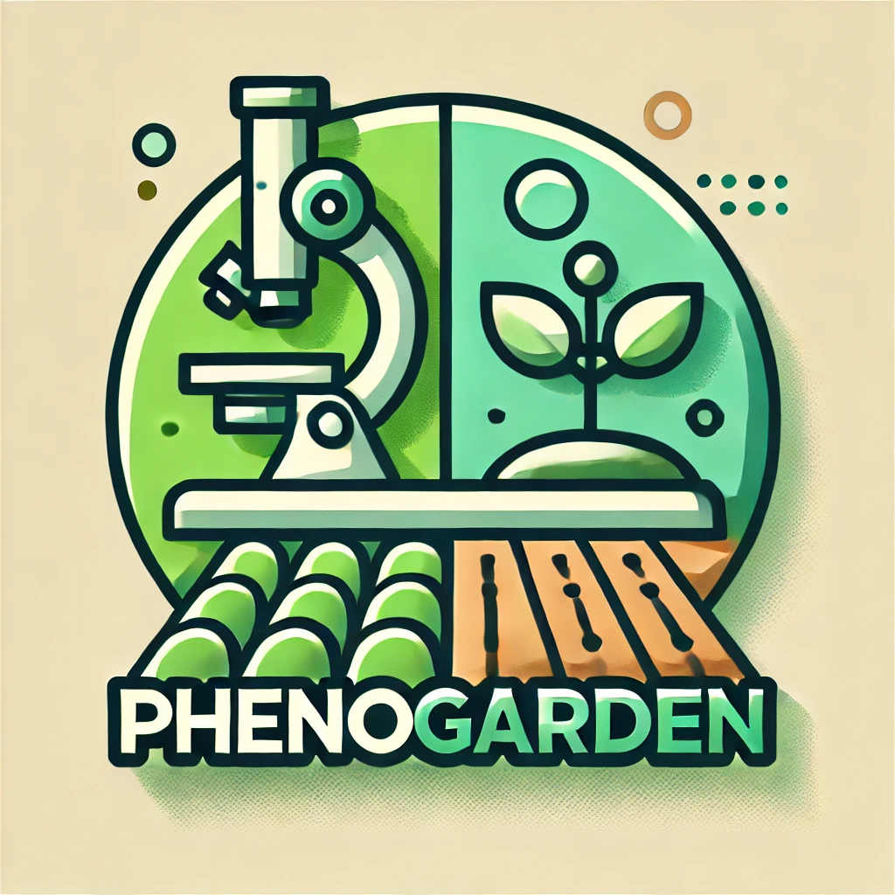
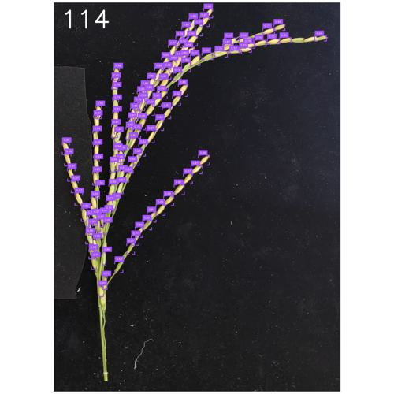
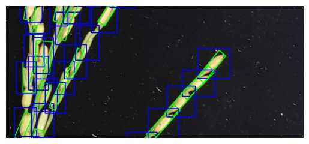
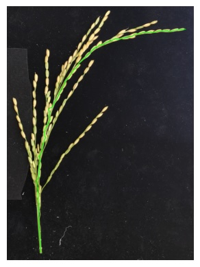
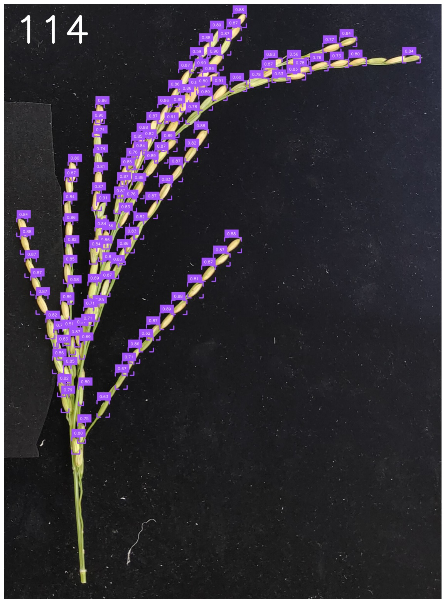

# phenogarden

*A plant phenotyping pipeline garden (≒ model zoo)*

## Disclaimer

このレポジトリは論文やプロジェクトのレポジトリを再実装したものであり、基本的に準拠しているが、完全にトレースしたものではない。また、論文やプロジェクトの著作権はそれぞれの著者に帰属し、各々のライセンスに従うこと。なお、ライセンス自体は管理者がサーチした範囲での情報であり、正確性については保証しない。最新の情報は各リンク先を参照されたい。

English

This repository is a reimplementation of the repositories from papers and projects. It basically adheres to the original works, but it is not an exact trace. The copyrights for the papers and projects belong to their respective authors and must be used in accordance with their individual licenses. Note that the license information is based on the extent of the administrator’s search, and its accuracy is not guaranteed. For the most up-to-date information, please refer to the respective links.

<!--  -->

---
*DO NOT EDIT BELLOW THIS LINE AS IT IS AUTO-GENERATED BY THE GITHUB ACTIONS*v

<!-- AUTO-GENERATED-TABLE -->

| Thumbnails | Module Name | Description | Publication | Original Git Repository | Original Data Repository | License | Tags | Notes |
|------------|------------|------------------|-------------|--------------------|----------------------|----------------------|-----------------------------|------|
|    | [Rice Intact Panicle Analysis](./modules/001_rice_panicle) | grain counting, grain shape analysis | [🔗](https://spj.science.org/doi/10.34133/plantphenomics.0213) | [🔗](https://github.com/SUNJHZAU/EOPT) | [🔗](https://pan.baidu.com/s/1ht2bUoqNQUWUJT5fuXBBrQ?pwd=m4wm) | Plant Phenomics Journal License / GPLv3 (yolov8 subsection) | rice, panicle, grain number, object detection, grain shape | None |
|  | [Tomato fruit and disease detection](./modules/002_tomato_fruit_and_leaf_detection) | tomato fruit detection, leaf disease detection | [🔗](https://spj.science.org/doi/10.34133/plantphenomics.0174) | [🔗](https://github.com/RuiKangnj/TGI/tree/main) | [🔗](https://drive.google.com/file/d/1G1E-6ADPoj9g6SUZs6URc2-tWRqulQ5I/view) | Plant Phenomics Journal License | tomato, fruit, disease, object detection, leaf | None |

