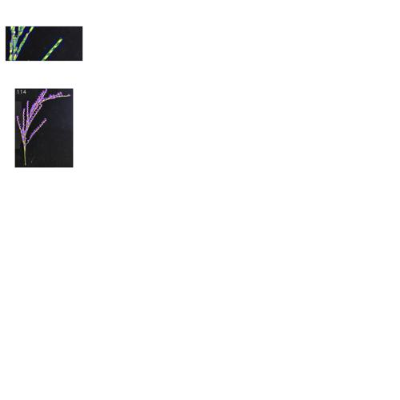

# phenogarden

*A plant phenotyping pipeline garden (≒ model zoo)*

---
*DO NOT EDIT BELLOW THIS LINE AS IT IS AUTO-GENERATED BY THE GITHUB ACTIONS*v

*ここから下は自動編集されるため手動で改変しない*

<!-- AUTO-GENERATED-TABLE -->

| Module Name | Description | Publication | Original Git Repository | Original Data Repository | License | Tags | Notes |
|------------|------------------|-------------|--------------------|----------------------|----------------------|-----------------------------|------|
| [Rice Intact Panicle Analysis](./modules/001_rice_panicle) | grain counting, grain shape analysis | [🔗](https://spj.science.org/doi/10.34133/plantphenomics.0213) | [🔗](https://github.com/SUNJHZAU/EOPT) | [🔗](https://pan.baidu.com/s/1ht2bUoqNQUWUJT5fuXBBrQ?pwd=m4wm) | Plant Phenomics Journal License / GPLv3 (yolov8 subsection) | rice, panicle, grain number, object detection, grain shape | None |

